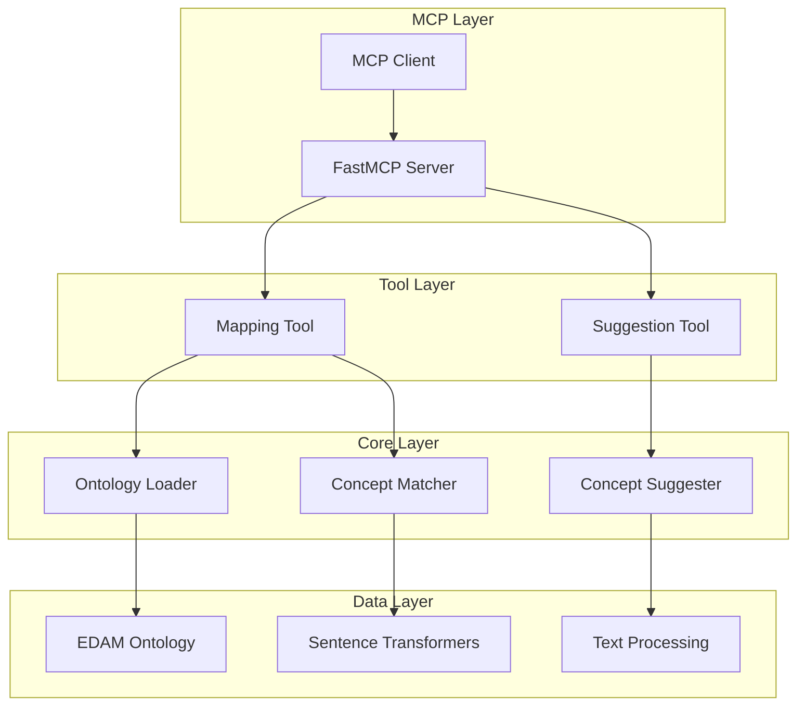
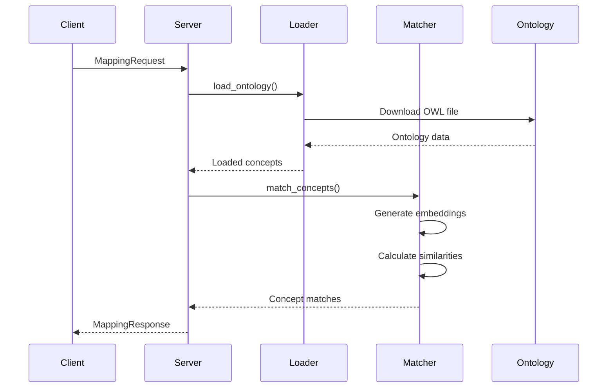
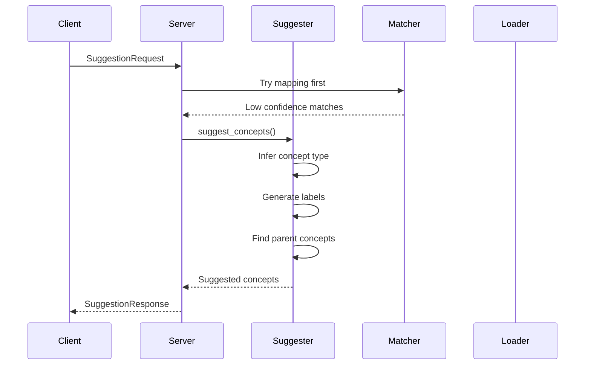

# Architecture

This document provides a comprehensive overview of the EDAM MCP Server architecture, including system design, component interactions, and data flow.

## 🏗️ System Overview

The EDAM MCP Server is built as a modular, async-first system that provides semantic matching and concept suggestion capabilities for the EDAM ontology.



## 📦 Core Components

### 1. FastMCP Server (`edam_mcp.main`)

The main server component that handles MCP protocol communication and tool registration.

**Key Responsibilities:**
- MCP protocol implementation
- Tool registration and routing
- Request/response handling
- Server lifecycle management

**Key Classes:**
- `FastMCP` - Main server instance
- `Context` - MCP context for logging and progress

### 2. Ontology Layer (`edam_mcp.ontology`)

Handles loading, parsing, and querying the EDAM ontology.

#### Ontology Loader (`edam_mcp.ontology.loader`)

**Responsibilities:**
- Download and parse EDAM OWL files
- Extract concept metadata (labels, definitions, synonyms)
- Build concept hierarchy
- Cache ontology data

**Key Methods:**
```python
class OntologyLoader:
    def load_ontology(self) -> bool
    def get_concept(self, uri: str) -> Optional[Dict]
    def search_concepts(self, query: str) -> List[Dict]
    def get_concept_hierarchy(self, concept_uri: str) -> List[str]
```

#### Concept Matcher (`edam_mcp.ontology.matcher`)

**Responsibilities:**
- Semantic similarity calculation
- Embedding generation and caching
- Exact and fuzzy matching
- Confidence scoring

**Key Methods:**
```python
class ConceptMatcher:
    def match_concepts(self, description: str, ...) -> List[ConceptMatch]
    def find_exact_matches(self, description: str) -> List[ConceptMatch]
    def get_concept_neighbors(self, concept_uri: str) -> List[ConceptMatch]
```

#### Concept Suggester (`edam_mcp.ontology.suggester`)

**Responsibilities:**
- Generate new concept suggestions
- Infer concept types
- Suggest hierarchical placement
- Calculate suggestion confidence

**Key Methods:**
```python
class ConceptSuggester:
    def suggest_concepts(self, description: str, ...) -> List[SuggestedConcept]
    def _infer_concept_type(self, description: str) -> str
    def _generate_label_variations(self, text: str) -> List[str]
```

### 3. Tool Layer (`edam_mcp.tools`)

MCP tool implementations that expose functionality to clients.

#### Mapping Tool (`edam_mcp.tools.mapping`)

**Responsibilities:**
- Handle mapping requests
- Coordinate ontology loading and matching
- Return structured responses
- Error handling and logging

**API:**
```python
@mcp.tool
async def map_to_edam_concept(
    request: MappingRequest,
    context: Context
) -> MappingResponse
```

#### Suggestion Tool (`edam_mcp.tools.suggestion`)

**Responsibilities:**
- Handle suggestion requests
- Attempt mapping first, then suggest
- Generate multiple suggestion approaches
- Return hierarchical suggestions

**API:**
```python
@mcp.tool
async def suggest_new_concept(
    request: SuggestionRequest,
    context: Context
) -> SuggestionResponse
```

### 4. Models Layer (`edam_mcp.models`)

Pydantic models for request/response validation and serialization.

#### Request Models (`edam_mcp.models.requests`)

- `MappingRequest` - Input for concept mapping
- `SuggestionRequest` - Input for concept suggestion

#### Response Models (`edam_mcp.models.responses`)

- `ConceptMatch` - Individual concept match with confidence
- `MappingResponse` - Complete mapping results
- `SuggestedConcept` - New concept suggestion
- `SuggestionResponse` - Complete suggestion results

### 5. Utilities (`edam_mcp.utils`)

Helper functions for text processing and similarity calculation.

#### Text Processing (`edam_mcp.utils.text_processing`)

**Functions:**
- `preprocess_text()` - Clean and normalize text
- `extract_keywords()` - Extract key terms
- `tokenize_text()` - Split text into tokens

#### Similarity (`edam_mcp.utils.similarity`)

**Functions:**
- `calculate_cosine_similarity()` - Vector similarity
- `calculate_jaccard_similarity()` - Set similarity
- `calculate_string_similarity()` - String similarity

## 🔄 Data Flow

### 1. Concept Mapping Flow



### 2. Concept Suggestion Flow



## 🎯 Design Principles

### 1. **Modularity**
- Clear separation of concerns
- Loose coupling between components
- Easy to extend and modify

### 2. **Async-First**
- All I/O operations are async
- Non-blocking ontology loading
- Concurrent request handling

### 3. **Lazy Loading**
- Heavy dependencies loaded on demand
- Ontology cached after first load
- ML models loaded only when needed

### 4. **Type Safety**
- Complete type hints throughout
- Pydantic validation for all data
- Runtime type checking

### 5. **Error Handling**
- Graceful degradation
- Detailed error messages
- Proper logging at all levels

## 🔧 Configuration

The system is configured through environment variables and the `Settings` class:

```python
class Settings(BaseSettings):
    edam_ontology_url: str
    similarity_threshold: float
    max_suggestions: int
    embedding_model: str
    cache_ttl: int
    log_level: str
```

## 📊 Performance Characteristics

### Memory Usage
- **Base**: ~50MB (Python + dependencies)
- **Ontology**: ~100MB (3,515 concepts)
- **ML Models**: ~350MB (sentence transformers)
- **Total**: ~500MB

### Response Times
- **First Run**: ~5 seconds (model download)
- **Subsequent Runs**: <1 second
- **Ontology Loading**: ~2 seconds
- **Semantic Matching**: ~0.5 seconds

### Scalability
- **Concurrent Requests**: Full async support
- **Memory Scaling**: Linear with ontology size
- **CPU Scaling**: Parallel embedding generation

## 🔮 Future Enhancements

### Planned Improvements
1. **Caching Layer**: Redis for distributed caching
2. **Database Backend**: PostgreSQL for ontology storage
3. **Batch Processing**: Bulk concept mapping
4. **Custom Models**: Fine-tuned embedding models
5. **API Versioning**: Backward compatibility

### Extension Points
1. **New Tool Types**: Additional MCP tools
2. **Alternative Matchers**: Different similarity algorithms
3. **External APIs**: Integration with other ontologies
4. **Plugin System**: Third-party extensions 