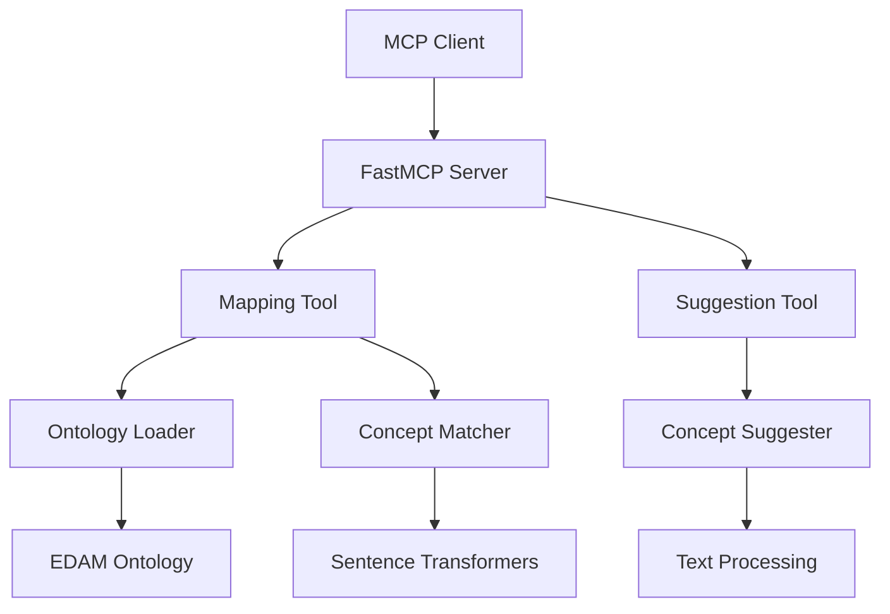

# EDAM MCP Server Documentation

Welcome to the EDAM MCP Server documentation! This server provides powerful tools for mapping descriptions to EDAM ontology concepts and suggesting new concepts when no suitable match exists. Developer docs at https://edamontology.github.io/edammcp

## 🚀 Quick Start

Get up and running in minutes:

```bash
# Install dependencies
uv sync --dev

# Test basic functionality
uv run python examples/simple_test.py

# Start the server
uv run python -m edam_mcp.main
```

## 🎯 What This Server Does

The EDAM MCP Server provides two main capabilities:

### 1. Concept Mapping
Map free-text descriptions to existing EDAM ontology concepts with confidence scores.

```python
# Example: Map a tool description to EDAM concepts
response = await map_to_edam_concept(
    description="sequence alignment tool",
    context="bioinformatics tool"
)
# Returns: "Sequence alignment" (confidence: 0.85)
```

### 2. Concept Suggestion
Generate suggestions for new EDAM concepts when no suitable existing concept is found.

```python
# Example: Suggest a new concept
response = await suggest_new_concept(
    description="quantum computing for protein folding",
    concept_type="Operation"
)
# Returns: "Quantum Protein Folding" with hierarchical placement
```

Prospectively, this could then be used to generate an automatic PR in knowledge graph change language (KGCL) to the maintainers of the ontology.

## 📚 Documentation Sections

### For Developers

- **[Architecture](developer/architecture.md)** - High-level system design and components
- **[API Reference](developer/api.md)** - Complete API documentation with examples
- **[Models](developer/models.md)** - Pydantic models for requests and responses
- **[Tools](developer/tools.md)** - MCP tool implementations and usage
- **[Ontology](developer/ontology.md)** - EDAM ontology handling and processing
- **[Utilities](developer/utils.md)** - Helper functions and utilities

### For Users

- **[Installation](getting-started/installation.md)** - Setup and installation guide
- **[Quick Start](getting-started/quickstart.md)** - Get running in 5 minutes
- **[Configuration](getting-started/configuration.md)** - Environment variables and settings
- **[Examples](examples/basic-usage.md)** - Practical usage examples
- **[MCP Integration](examples/mcp-integration.md)** - Integration with MCP clients

### For Contributors

- **[Development Setup](contributing/development-setup.md)** - Local development environment
- **[Adding Tools](contributing/adding-tools.md)** - How to add new MCP tools
- **[Testing](contributing/testing.md)** - Testing guidelines and practices
- **[Code Style](contributing/code-style.md)** - Coding standards and conventions

## 🔧 Key Features

- **Semantic Matching**: Uses sentence transformers for accurate concept matching
- **Confidence Scoring**: Provides confidence levels for all mappings
- **Hierarchical Placement**: Suggests appropriate placement in the EDAM ontology
- **FastMCP Integration**: Built with FastMCP 2.10.6 for optimal performance
- **Async Support**: Full async/await support for high-performance operations
- **Type Safety**: Complete type hints and Pydantic validation

## 🏗️ Architecture Overview



## 📊 Performance

- **Ontology Loading**: ~3,515 concepts loaded in ~2 seconds
- **Semantic Matching**: ~5 seconds for first run (model download), <1 second subsequent runs
- **Memory Usage**: ~500MB with ML models loaded
- **Concurrent Requests**: Full async support for multiple simultaneous requests

## 🤝 Contributing

We welcome contributions! See the [Contributing](contributing/development-setup.md) section for details on:

- Setting up your development environment
- Adding new features and tools
- Testing your changes
- Submitting pull requests

## 📄 License

This project is licensed under the MIT License - see the [LICENSE](../LICENSE) file for details. 
